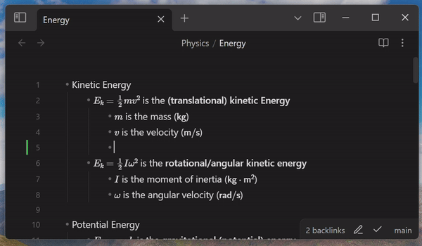

this is an obsidian plugin that add git gutter indicators to the editor. (like in vscode and other code editors)

this is **very early version** and it's **not working well** yet. i'd appreciate any help.

it's using https://github.com/steveukx/git-js (simple-git)  and https://npmjs.com/package/diff.

